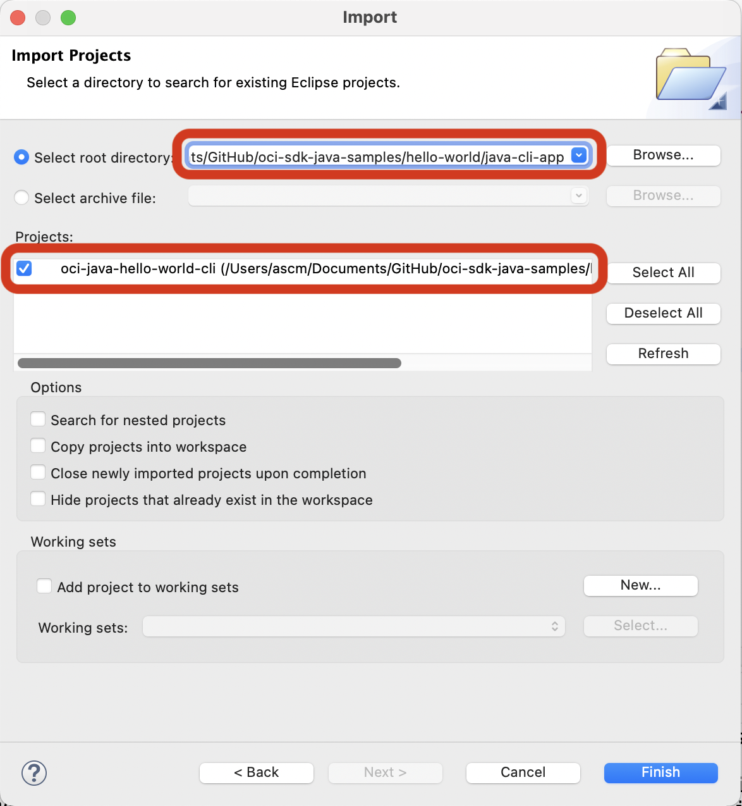
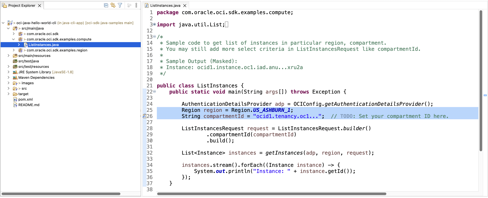
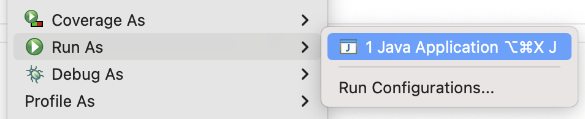

# Simple Java CLI App - OCI Java SDK Sample

[](https://img.shields.io/badge/license-UPL-green) [](https://sonarcloud.io/dashboard?id=oracle-devrel_oci-sdk-java-samples)

## Introduction
Software Development Kits (SDKs) Build and deploy apps that integrate with Oracle Cloud Infrastructure services. Each SDK provides the tools you need to develop an app, including code samples and documentation to create, test, and troubleshoot. In addition, if you want to contribute to the development of the SDKs, they are all open source and available on GitHub.

This project sample helps developers to setup their first OCI SDK based java application. This project contains all the required OCI SDK dependencies in `pom.xml`.

## Cloning this Sample
```
git init java-cli-app
cd java-cli-app
git remote add origin https://github.com/oracle-devrel/oci-sdk-java-samples.git
git config core.sparsecheckout true
echo "hello-world/java-cli-app/*">>.git/info/sparse-checkout
git pull --depth=1 origin main
cd hello-world/java-cli-app/
```

## Import Project into Eclipse IDE
### Step 1 (Setup Eclipse project)
* Open `File` > `Import` and choose `Existing Projects into Workspace` as below.

* Select `Root Directory` to your cloned location and choose (tick) project as shown below.

* Click on `Finish`. Now you can open `ListInstances` code as shown below and update `compartmentId` and `region` as per yours.


### Step 2 (Run the program)
* Click on `Run As` > `Java Application` from the `ListInstances.java` file.

* Here is the output with the list of instances in your `compartmentId` and `region`
```
[main] INFO com.oracle.bmc.Services - Registering new service: Services.BasicService(serviceName=COMPUTE, serviceEndpointPrefix=iaas, serviceEndpointTemplate=https://iaas.{region}.{secondLevelDomain}, endpointServiceName=null)
[main] INFO com.oracle.bmc.http.ApacheConfigurator - Setting connector provider to ApacheConnectorProvider
[main] INFO com.oracle.bmc.util.JavaRuntimeUtils - Determined JRE version as Unknown
[main] WARN com.oracle.bmc.http.ApacheConfigurator - Using an unknown runtime, calls may not work
[main] INFO com.oracle.bmc.Region - Loaded service 'COMPUTE' endpoint mappings: {AP_HYDERABAD_1=https://iaas.ap-hyderabad-1.oraclecloud.com}
[main] INFO com.oracle.bmc.core.ComputeClient - Setting endpoint to https://iaas.ap-hyderabad-1.oraclecloud.com
[main] INFO com.oracle.bmc.Region - Loaded service 'COMPUTE' endpoint mappings: {AP_HYDERABAD_1=https://iaas.ap-hyderabad-1.oraclecloud.com, US_ASHBURN_1=https://iaas.us-ashburn-1.oraclecloud.com}
[main] INFO com.oracle.bmc.core.ComputeClient - Setting endpoint to https://iaas.us-ashburn-1.oraclecloud.com
[main] INFO com.oracle.bmc.ClientRuntime - Using SDK: Oracle-JavaSDK/2.29.0
[main] INFO com.oracle.bmc.ClientRuntime - User agent set to: Oracle-JavaSDK/2.29.0 (Mac OS X/12.4; Java/18; Java HotSpot(TM) 64-Bit Server VM/18+36-2087)
Instance: ocid1.instance.oc1.iad.anuwcljsk56z2vqcfquswhixzittmtspctlxvm4u42vjebmtjmqbburxru2a
```

## References
* [OCI SDK - Official Documentation](https://docs.oracle.com/en-us/iaas/Content/API/Concepts/sdks.htm)
* [OCI SDK - Open Source GitHub Repository](https://github.com/oracle/oci-java-sdk)

## Contributors
* Author: Ashok Raja CM
* Collaborators: NA
* Last Review: Aug 2022

## Contributing
This project is open source.  Please submit your contributions by forking this repository and submitting a pull request!  Oracle appreciates any contributions that are made by the open source community.

## License
Copyright (c) 2022 Oracle and/or its affiliates.

Licensed under the Universal Permissive License (UPL), Version 1.0.

See [LICENSE](LICENSE) for more details.

ORACLE AND ITS AFFILIATES DO NOT PROVIDE ANY WARRANTY WHATSOEVER, EXPRESS OR IMPLIED, FOR ANY SOFTWARE, MATERIAL OR CONTENT OF ANY KIND CONTAINED OR PRODUCED WITHIN THIS REPOSITORY, AND IN PARTICULAR SPECIFICALLY DISCLAIM ANY AND ALL IMPLIED WARRANTIES OF TITLE, NON-INFRINGEMENT, MERCHANTABILITY, AND FITNESS FOR A PARTICULAR PURPOSE.  FURTHERMORE, ORACLE AND ITS AFFILIATES DO NOT REPRESENT THAT ANY CUSTOMARY SECURITY REVIEW HAS BEEN PERFORMED WITH RESPECT TO ANY SOFTWARE, MATERIAL OR CONTENT CONTAINED OR PRODUCED WITHIN THIS REPOSITORY. IN ADDITION, AND WITHOUT LIMITING THE FOREGOING, THIRD PARTIES MAY HAVE POSTED SOFTWARE, MATERIAL OR CONTENT TO THIS REPOSITORY WITHOUT ANY REVIEW. USE AT YOUR OWN RISK. 