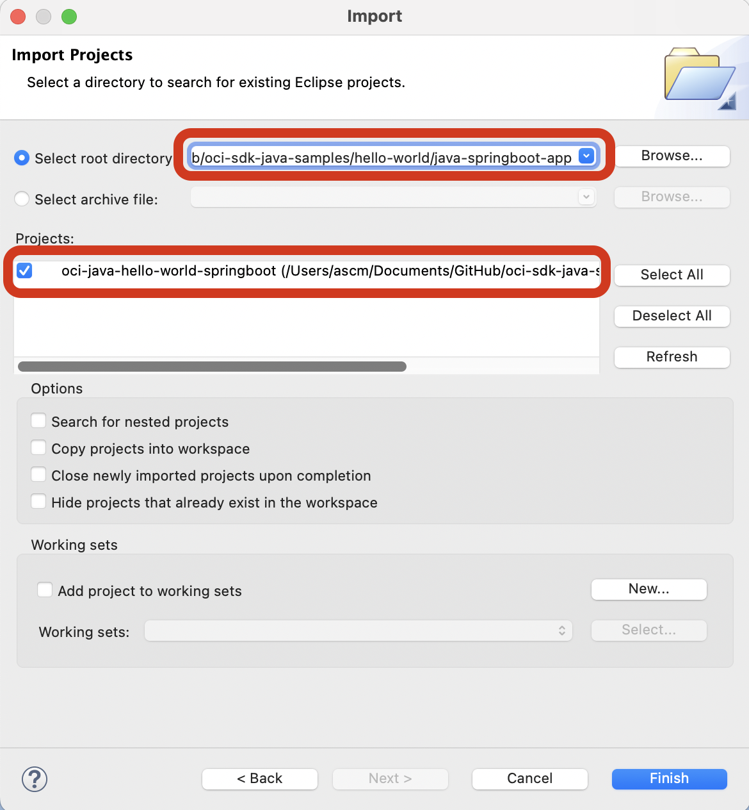
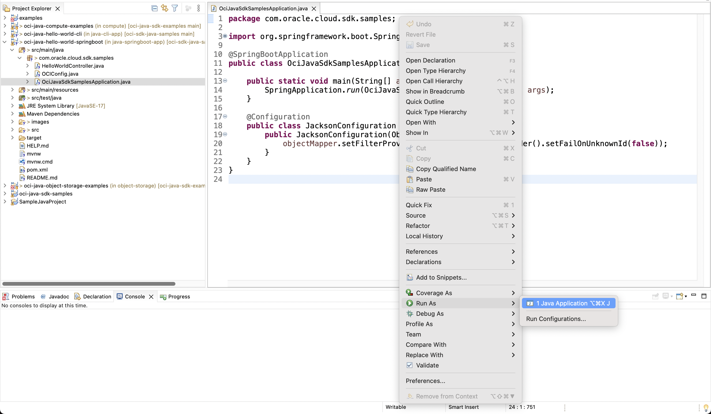

# Java Spring Boot App - OCI Java SDK Sample

[](https://img.shields.io/badge/license-UPL-green) [](https://sonarcloud.io/dashboard?id=oracle-devrel_oci-sdk-java-samples)

## Introduction
Software Development Kits (SDKs) Build and deploy apps that integrate with Oracle Cloud Infrastructure services. Each SDK provides the tools you need to develop an app, including code samples and documentation to create, test, and troubleshoot. In addition, if you want to contribute to the development of the SDKs, they are all open source and available on GitHub.

This project sample helps developers to setup their first OCI SDK based java spring boot application. This project contains all the required OCI SDK dependencies in `pom.xml`.

## Cloning this Sample
```
git init java-springboot-app
cd java-springboot-app
git remote add origin https://github.com/oracle-devrel/oci-sdk-java-samples.git
git config core.sparsecheckout true
echo "hello-world/java-springboot-app/*">>.git/info/sparse-checkout
git pull --depth=1 origin main
cd hello-world/java-springboot-app/
```

## Import Project into Eclipse IDE
### Step 1 (Setup Eclipse project)
* Open `File` > `Import` and choose `Existing Projects into Workspace` as below.

* Select `Root Directory` to your cloned location and choose (tick) project as shown below.

* Click on `Finish`. 


### Step 2 (Run the program)
* Click on `Run As` > `Java Application` from the `OciJavaSdkSamplesApplication.java` file.

* Wait for the successful start of the Spring Boot service. (sample logs shown here)
```

  .   ____          _            __ _ _
 /\\ / ___'_ __ _ _(_)_ __  __ _ \ \ \ \
( ( )\___ | '_ | '_| | '_ \/ _` | \ \ \ \
 \\/  ___)| |_)| | | | | || (_| |  ) ) ) )
  '  |____| .__|_| |_|_| |_\__, | / / / /
 =========|_|==============|___/=/_/_/_/
 :: Spring Boot ::                (v2.7.2)

2022-08-15 18:53:46.888  INFO 97095 --- [           main] c.o.c.s.s.OciJavaSdkSamplesApplication   : Starting OciJavaSdkSamplesApplication using Java 18 on ascm-mac with PID 97095 (/Users/ascm/Documents/GitHub/oci-sdk-java-samples/hello-world/java-springboot-app/target/classes started by ascm in /Users/ascm/Documents/GitHub/oci-sdk-java-samples/hello-world/java-springboot-app)
2022-08-15 18:53:46.892  INFO 97095 --- [           main] c.o.c.s.s.OciJavaSdkSamplesApplication   : No active profile set, falling back to 1 default profile: "default"
2022-08-15 18:53:48.409  INFO 97095 --- [           main] o.s.b.w.embedded.tomcat.TomcatWebServer  : Tomcat initialized with port(s): 8080 (http)
2022-08-15 18:53:48.421  INFO 97095 --- [           main] o.apache.catalina.core.StandardService   : Starting service [Tomcat]
2022-08-15 18:53:48.421  INFO 97095 --- [           main] org.apache.catalina.core.StandardEngine  : Starting Servlet engine: [Apache Tomcat/9.0.65]
2022-08-15 18:53:48.660  INFO 97095 --- [           main] o.a.c.c.C.[Tomcat].[localhost].[/]       : Initializing Spring embedded WebApplicationContext
2022-08-15 18:53:48.660  INFO 97095 --- [           main] w.s.c.ServletWebServerApplicationContext : Root WebApplicationContext: initialization completed in 1684 ms
2022-08-15 18:53:49.323  INFO 97095 --- [           main] o.s.b.w.embedded.tomcat.TomcatWebServer  : Tomcat started on port(s): 8080 (http) with context path ''
2022-08-15 18:53:49.336  INFO 97095 --- [           main] c.o.c.s.s.OciJavaSdkSamplesApplication   : Started OciJavaSdkSamplesApplication in 3.002 seconds (JVM running for 3.703)
```
* On the browser, Hit the URL `http://localhost:8080/instances?compartmentId=<COMPARTMENT_ID>` (replace <COMPARTMENT_ID>) to see list of instances.
**Note:** Optionally you may pass `region` to fetch from specific region. Else it would fetch from `US_ASHBURN_1`
* Hit the URL `http://localhost:8080/regions` to list all the regions.

## References
* [OCI SDK - Official Documentation](https://docs.oracle.com/en-us/iaas/Content/API/Concepts/sdks.htm)
* [OCI SDK - Open Source GitHub Repository](https://github.com/oracle/oci-java-sdk)

## Contributors
* Author: Ashok Raja CM
* Collaborators: NA
* Last Review: Aug 2022

## Contributing
This project is open source.  Please submit your contributions by forking this repository and submitting a pull request!  Oracle appreciates any contributions that are made by the open source community.

## License
Copyright (c) 2022 Oracle and/or its affiliates.

Licensed under the Universal Permissive License (UPL), Version 1.0.

See [LICENSE](LICENSE) for more details.

ORACLE AND ITS AFFILIATES DO NOT PROVIDE ANY WARRANTY WHATSOEVER, EXPRESS OR IMPLIED, FOR ANY SOFTWARE, MATERIAL OR CONTENT OF ANY KIND CONTAINED OR PRODUCED WITHIN THIS REPOSITORY, AND IN PARTICULAR SPECIFICALLY DISCLAIM ANY AND ALL IMPLIED WARRANTIES OF TITLE, NON-INFRINGEMENT, MERCHANTABILITY, AND FITNESS FOR A PARTICULAR PURPOSE.  FURTHERMORE, ORACLE AND ITS AFFILIATES DO NOT REPRESENT THAT ANY CUSTOMARY SECURITY REVIEW HAS BEEN PERFORMED WITH RESPECT TO ANY SOFTWARE, MATERIAL OR CONTENT CONTAINED OR PRODUCED WITHIN THIS REPOSITORY. IN ADDITION, AND WITHOUT LIMITING THE FOREGOING, THIRD PARTIES MAY HAVE POSTED SOFTWARE, MATERIAL OR CONTENT TO THIS REPOSITORY WITHOUT ANY REVIEW. USE AT YOUR OWN RISK. 