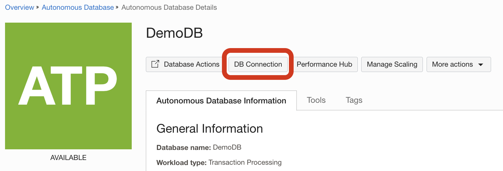
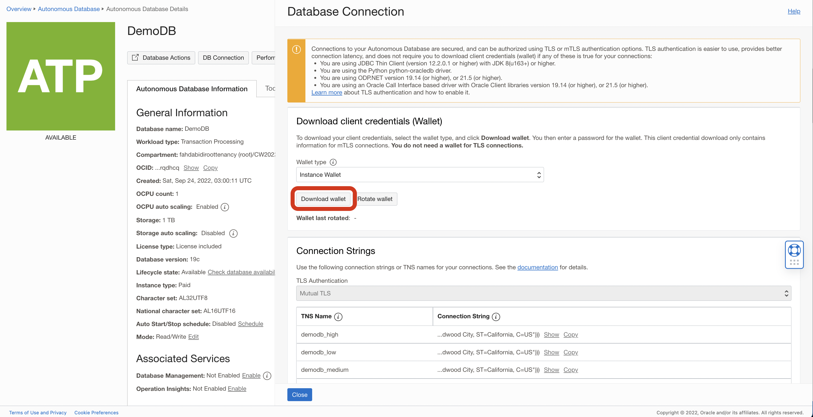
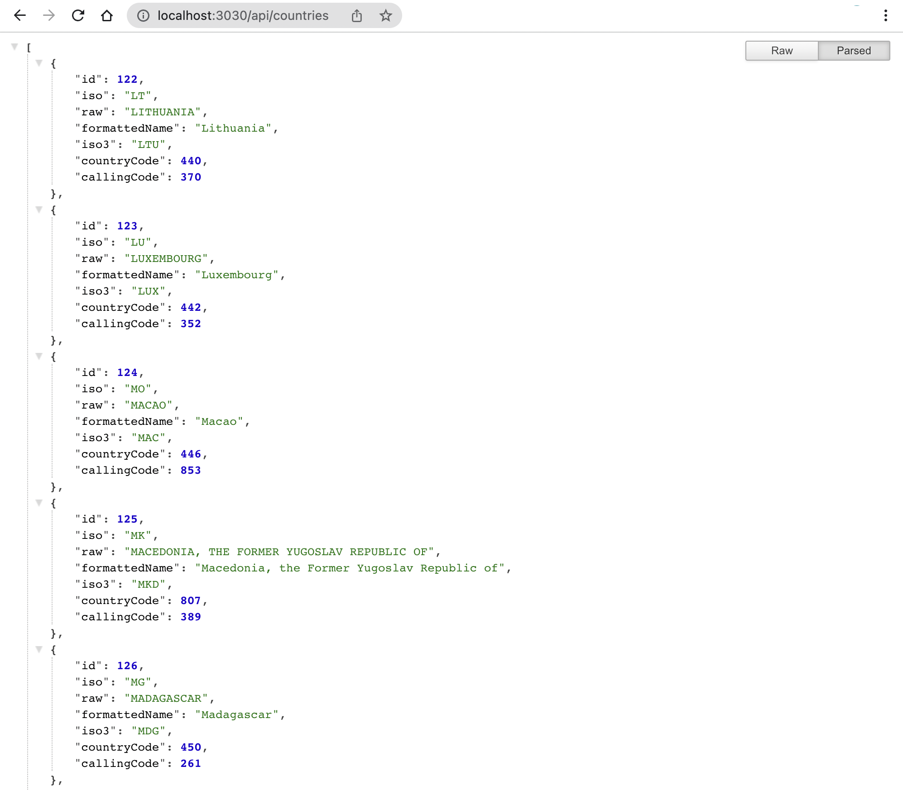

# Connecting to OCI Autonomous Oracle Database - OCI Java Sample

[](https://img.shields.io/badge/license-UPL-green) [](https://sonarcloud.io/dashboard?id=oracle-devrel_oci-sdk-java-samples)

## Introduction
This project sample showcases the sample code to connect to OCI Autonomous Database service on an Spring Boot application. This project contains all the required dependencies in `pom.xml`.

## Prerequisites
* Create Autonomous Database. Refer [here](https://docs.oracle.com/en/cloud/paas/atp-cloud/tutorial-getting-started-autonomous-db/index.html) for details
* Load countries sample data from [db/countries.sql](./db/countries.sql)

## Cloning this Sample
If you have your OCI tenancy and want to try out this sample, click on 'Open in Code Editor' button below.

[](https://cloud.oracle.com/?region=home&cs_repo_url=https://github.com/oracle-devrel/oci-sdk-java-samples.git&cs_open_ce=true&cs_readme_path=usecases/connect-autonomous-database/README.md)

or 

```
git init connect-autonomous-database
cd connect-autonomous-database
git remote add origin https://github.com/oracle-devrel/oci-sdk-java-samples.git
git config core.sparsecheckout true
echo "usecases/connect-autonomous-database/*">>.git/info/sparse-checkout
git pull --depth=1 origin main
cd usecases/connect-autonomous-database/
```

## Import Project into Eclipse IDE
### Step 1 (Setup Eclipse project)
* Open `File` > `Import` and choose `Existing Projects into Workspace`.
* Select `Root Directory` to your cloned location and choose (tick) project.
* Click on `Finish`. 

### Step 2 (Download DB wallet)
* Click on `DB Connection` on ADB page.

* Click on `Download` to get the wallet zip.

* Extract the wallet.zip to some location.

### Step 3 (Update Wallet Info)
* We can pass DB details as environment variables. else Open `application.properties` and change below properties.
```
spring.datasource.url=jdbc:oracle:thin:@${ADB_NAME}?TNS_ADMIN=${EXTRACTED_ADB_WALLET_LOCATION}
spring.datasource.username=${ADB_USERNAME}
spring.datasource.password=${ADB_PASSWORD}
```
**Note** For production, wallet location is mounted from secrets.

### Step 2 (Run the program)
**Note:** Pass `ADB_USERNAME`, `ADB_PASSWORD`, `ADB_NAME` and `EXTRACTED_ADB_WALLET_LOCATION` environment variables or change the `application.properties` as appropriately.
* Click on `Run As` > `Java Application` from the `MainApplication.java` file.
* Wait for the successful start of the Spring Boot service. (sample logs shown here)
```
SLF4J: Class path contains multiple SLF4J bindings.
SLF4J: Found binding in [jar:file:/Users/ascm/.m2/repository/ch/qos/logback/logback-classic/1.2.11/logback-classic-1.2.11.jar!/org/slf4j/impl/StaticLoggerBinder.class]
SLF4J: Found binding in [jar:file:/Users/ascm/.m2/repository/org/slf4j/slf4j-simple/1.7.36/slf4j-simple-1.7.36.jar!/org/slf4j/impl/StaticLoggerBinder.class]
SLF4J: See http://www.slf4j.org/codes.html#multiple_bindings for an explanation.
SLF4J: Actual binding is of type [ch.qos.logback.classic.util.ContextSelectorStaticBinder]

  .   ____          _            __ _ _
 /\\ / ___'_ __ _ _(_)_ __  __ _ \ \ \ \
( ( )\___ | '_ | '_| | '_ \/ _` | \ \ \ \
 \\/  ___)| |_)| | | | | || (_| |  ) ) ) )
  '  |____| .__|_| |_|_| |_\__, | / / / /
 =========|_|==============|___/=/_/_/_/
 :: Spring Boot ::                (v2.7.2)

...
...
...
```
* On the browser, Hit the URL `http://localhost:3030/api/countries` to get the countries from DB.


## References
* [OCI Autonomous Database](https://www.oracle.com/in/autonomous-database/)
* [OCI ADB Overview](https://docs.oracle.com/en-us/iaas/Content/Database/Concepts/adboverview.htm)

## Contributors
* Author: Ashok Raja CM
* Collaborators: NA
* Last Review: Oct 2022

## Contributing
This project is open source.  Please submit your contributions by forking this repository and submitting a pull request!  Oracle appreciates any contributions that are made by the open source community.

## License
Copyright (c) 2022 Oracle and/or its affiliates.

Licensed under the Universal Permissive License (UPL), Version 1.0.

See [LICENSE](../../LICENSE) for more details.

ORACLE AND ITS AFFILIATES DO NOT PROVIDE ANY WARRANTY WHATSOEVER, EXPRESS OR IMPLIED, FOR ANY SOFTWARE, MATERIAL OR CONTENT OF ANY KIND CONTAINED OR PRODUCED WITHIN THIS REPOSITORY, AND IN PARTICULAR SPECIFICALLY DISCLAIM ANY AND ALL IMPLIED WARRANTIES OF TITLE, NON-INFRINGEMENT, MERCHANTABILITY, AND FITNESS FOR A PARTICULAR PURPOSE.  FURTHERMORE, ORACLE AND ITS AFFILIATES DO NOT REPRESENT THAT ANY CUSTOMARY SECURITY REVIEW HAS BEEN PERFORMED WITH RESPECT TO ANY SOFTWARE, MATERIAL OR CONTENT CONTAINED OR PRODUCED WITHIN THIS REPOSITORY. IN ADDITION, AND WITHOUT LIMITING THE FOREGOING, THIRD PARTIES MAY HAVE POSTED SOFTWARE, MATERIAL OR CONTENT TO THIS REPOSITORY WITHOUT ANY REVIEW. USE AT YOUR OWN RISK. 